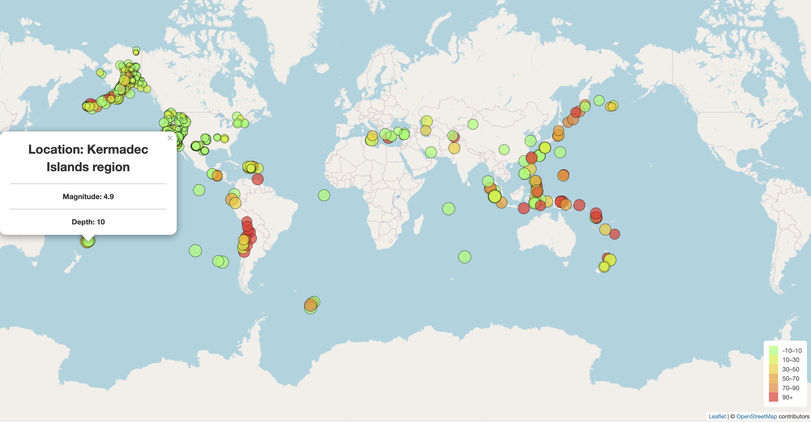

# leaflet-challenge

# Final output
My site is live at https://minmincg.github.io/earthquake_Analysis/
# Background info:

The United States Geological Survey, or USGS for short, is responsible for providing scientific data about natural hazards, the health of our ecosystems and environment, and the impacts of climate and land-use change. Their scientists develop new methods and tools to supply timely, relevant, and useful information about the Earth and its processes.

I built a new set of tools that will allow them to visualize their earthquake data. They collect a massive amount of data from all over the world each day, but they lack a meaningful way of displaying it. 

I developed a way to visualize USGS data that will allow them to better educate the public and other government organizations (and hopefully secure more funding) on issues facing our planet.

This data set was taken from the page : https://earthquake.usgs.gov/earthquakes/feed/v1.0/geojson.php

I specifically used th data under past 7 days, all earthquakes. The data comes from the following link:
https://earthquake.usgs.gov/earthquakes/feed/v1.0/summary/all_week.geojson

Here's a picture with the results of directory "part 1". It is basic. Only has streetmap and the earthquakes:

#### Streetmap reference: "https://www.openstreetmap.org/copyright" OpenStreetMap contributors'

Next, I stepped it up a knodge and added different maps bases to choose from, and added tectonic plates for interaction. You can turn on and off both earthquake markers and plates. Also you can use the control to switch between map types. Heres a preview of the advanced version:

#### Topographic map reference: "https://www.openstreetmap.org/copyright"
contributors, "http://viewfinderpanoramas.org" 
Map style:"https://opentopomap.org">OpenTopoMap "https://creativecommons.org/licenses/by-sa/3.0/"

Outdoors map reference: 
'Map tiles by <a href="http://stamen.com">Stamen Design</a>, <a href="http://creativecommons.org/licenses/by/3.0">CC BY 3.0</a> &mdash; Map data &copy; <a href="https://www.openstreetmap.org/copyright">OpenStreetMap</a> contributors',

